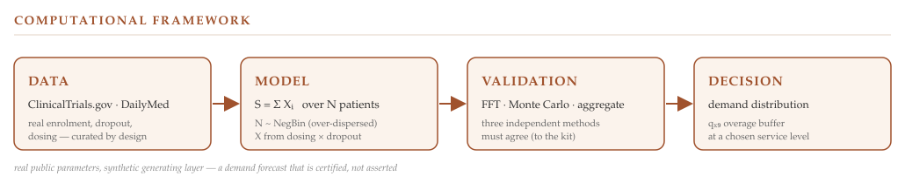
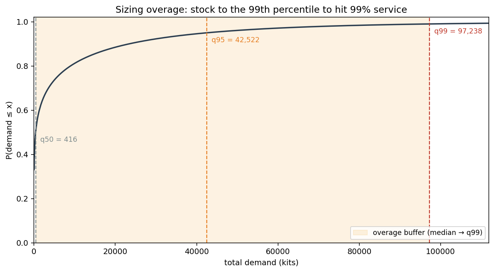
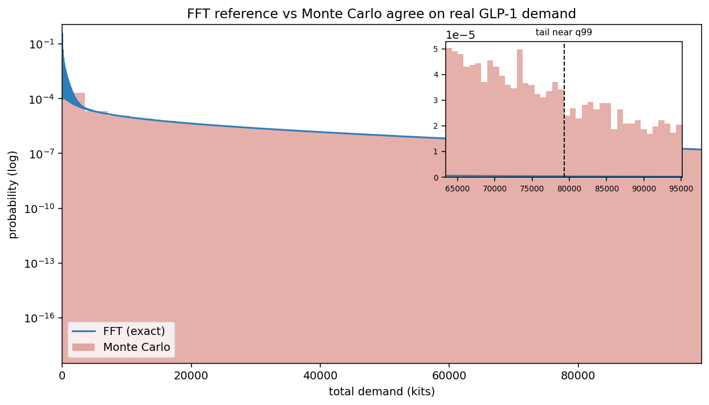

# Clinical-Trial Drug-Demand Forecasting



**Forecasting the drug a clinical-trial depot must stock under uncertain enrolment and consumption —
a compound-distribution model, computed exactly by FFT convolution and cross-validated by three
independent methods (FFT · Monte Carlo · `aggregate`).**

---

## Overview

Clinical trials must commit expensive drug inventory to their depots months before enrolment is known,
and both errors cost: ship too little and a patient misses a dose, ship too much and product expires
unused. This repository computes the *entire* demand distribution — not just the average — and sizes
the buffer stock (the *overage*) for any chosen service level.

Its organising principle is that a forecast is only trustworthy if the same distribution, computed by
**independent methods**, agrees. Total demand is therefore obtained several ways that must reconcile:
an exact FFT convolution as the reference, a Monte-Carlo simulation, and the field-standard
`aggregate` library — anchored by closed-form moments and a known-answer case.

The accompanying technical note (`Clinical_Supply_Demand_Note.pdf`) develops the methodology and
results in full.

---

## Contributions

- exact FFT computation of the compound demand distribution;
- adaptive lattice sizing that eliminates FFT aliasing in the tail;
- independent validation against a Monte-Carlo simulation;
- independent validation against the `aggregate` package;
- a reproducible pipeline from public clinical-trial registries.

---

## Headline results

On a real GLP-1 cohort (weekly injectable, ~72-week treatment), a depot serving five sites over a
twelve-month horizon:



- **A small median, an enormous tail.** Typical demand is 233 kits (q50); covering 99 % of scenarios
  needs **≈ 79,000 kits** (q99) — a roughly **340-fold gap**, driven by heavy-tailed enrolment. That
  gap is the price of a service guarantee, and the cumulative distribution above is the instrument for
  choosing the service level.
- **Three independent methods agree to the kit.** From-scratch FFT, Monte Carlo, and `aggregate` land
  on the same q99 (79,292), with the known-answer case exact to ~10^-16.
- **A real numerical finding, surfaced by the cross-check.** The methods first *disagreed* in the tail
  (the FFT read q99 ~12 % low); the cause was **FFT aliasing** — the heavy tail wrapped around a
  too-narrow lattice — resolved by sizing the lattice to the distribution. A single method would have
  hidden it.

---

## Method

| Component | Approach |
|---|---|
| Patient count *N* | Over-dispersed **Negative Binomial** (mixed-Poisson / Poisson–Gamma), fitted by moments |
| Per-patient consumption *X* | Kits from the dosing schedule, tempered by a constant-hazard dropout model |
| Aggregation | Compound distribution *S = ΣXi*, solved **exactly** by FFT convolution of the generating function |
| Lattice control | Adaptive width — grown until the wrapped (aliased) tail mass is negligible |
| Validation | Known-answer case · moment identities · Monte Carlo · independent `aggregate` implementation |
| Data | Real Phase-3 trial parameters from ClinicalTrials.gov (curated to chronic parallel-group), dosing cross-checked against DailyMed |

The exact FFT reference and the Monte-Carlo simulation agree across the whole demand distribution,
including the far tail that sizes the buffer:



The aggregate machinery uses S. J. Mildenhall's [`aggregate`](https://github.com/mynl/aggregate) package.

---

## Scope

The model fits trials with **uncertain patient counts and supply committed ahead of enrolment** —
small molecules, oral drugs, and (the high-value case) **monoclonal antibodies and other biologics**
dispensed from depot stock. It does **not** fit bespoke per-patient therapies such as **CAR-T**, where
each dose is made for an already-identified patient and supply is a scheduling problem, not a
distribution.

---

## Repository contents

| Path | Description |
|---|---|
| `clinical_supply_validation.ipynb` | Complete, reproducible implementation (acquisition + model + validation + figures) |
| `Clinical_Supply_Demand_Note.pdf` | Technical note: methodology, validation, results |
| `figures/` | Framework banner and result figures used in the note and this README |

---

## Requirements & reproduction

Python 3.12 or later, with:

```
numpy · pandas · scipy · matplotlib · requests · aggregate
```

To reproduce:

1. Run the notebook top to bottom (Kernel → Restart & Run All). The **acquisition half** (§1–§2)
   fetches real trial parameters live from ClinicalTrials.gov and DailyMed and needs internet.
2. The **model half** (§3–§4) runs offline — from the frozen `params.json` if acquisition has run, or
   from realistic built-in defaults otherwise — and regenerates every figure and validation table.

*Real public parameters, synthetic generating layer:* inputs trace to real trials (by NCT id), the
simulation runs from them, so the ground truth is known and the study reproduces without re-fetching.

---

## Why this repository is different

Most demonstrations stop at a forecast. Here the forecast itself is treated as something to be
**certified, not asserted**: every headline figure is reproduced independently by exact FFT
convolution, Monte-Carlo simulation, and the `aggregate` package, and the tail that sizes inventory is
the part checked hardest. The same discipline runs through the companion
[LongevityRisk](https://github.com/evrelegh/LongevityRisk) study — the aim is not to produce a number,
but to establish that the number is right.

---

## Author

**Erik Van Releghem** · PHNX

A reproducible research implementation, intended for research and educational use rather than
production software.
